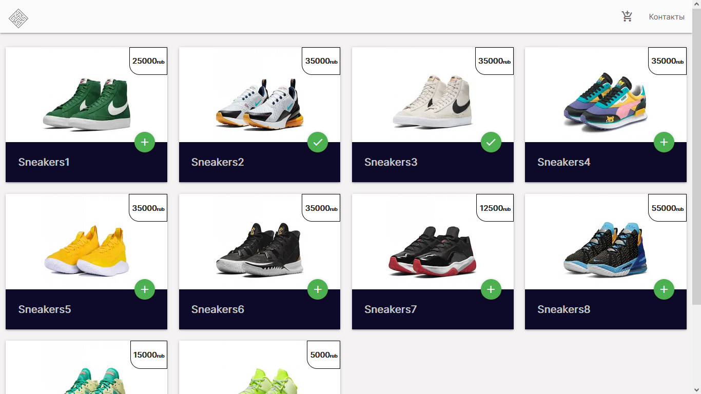

This is a [Next.js](https://nextjs.org/) project bootstrapped with [`create-next-app`](https://github.com/vercel/next.js/tree/canary/packages/create-next-app).

## Getting Started

First, run the development server:

```bash
npm run dev
# or
yarn dev
```

Using in project: 
-
* Next.js
* TypeScript
* MobX
* Axios
* Json-server
* Materialize - CSS framework

​
This is my firt project
